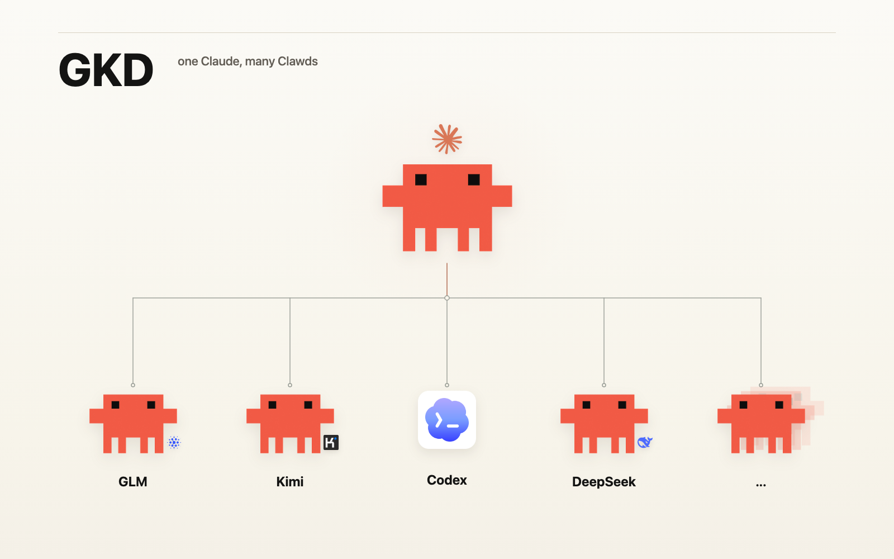
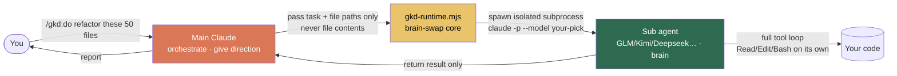
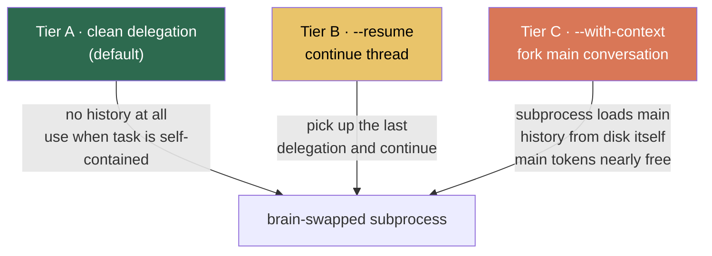
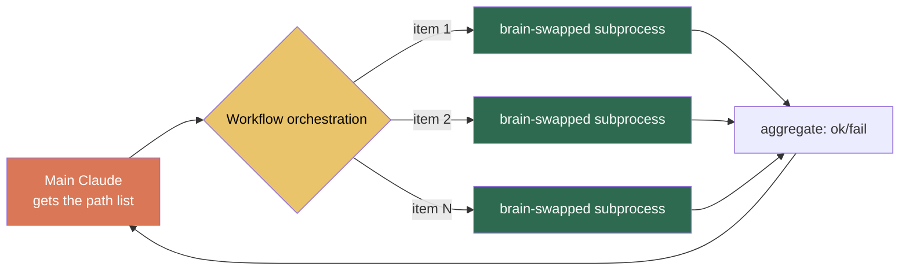

<p align="center"></p>

# GKD · Gao Kuai Dian ("hurry up")

<p align="right"><a href="./README.md">中文</a> · <a href="./README.en.md">English</a></p>

> **GKD** is the pinyin initials of *gǎo kuài diǎn* ("hurry up" in Chinese) — and also the initials of three frontier open-source models: **G**LM · **K**imi · **D**eepseek.

GKD is a [Claude Code](https://claude.com/claude-code) plugin. It borrows Claude Code's own tool loop (harness) to spawn a subprocess whose **brain is any model you choose** — the subprocess has a full Read/Edit/Bash toolset, reads files, thinks, edits code, and runs commands in its own context, and returns only the **result** to your main conversation.

Two goals of equal weight:

- **Save tokens** — the heavy lifting happens in the subprocess; the main Claude only pays for "instruction + result." Downgradeable work goes to a cheaper model.
- **Borrow another model's perspective** — code, long-document summarization, vision, hard reasoning each have their own strengths. Swapping the brain lets you avoid being steered by one model's biases during brainstorm / cross-review, and hands each task to whichever model is best at it.

---

## What it solves

There are two problems with Claude Code: first, a lot of work doesn't actually **need** the most expensive flagship model (boilerplate, bulk homogeneous rewrites, format/language conversion, summarizing long docs, code review…), yet it all gets fed to the same main model and tokens burn fast; second, you're **locked into one model's perspective** — if you want to hear how GLM, Kimi, Deepseek, or GPT each see the same problem, you have to switch by hand.

GKD's approach is to **subcontract to another brain**: the main Claude gives direction, and the actual read/write/run work goes to a brain-swapped subprocess.



The key discipline: **the main Claude never reads file contents and forwards them to the subprocess** — it passes only file paths, and the subprocess reads them itself. That way the main conversation's token usage is little more than the instruction itself.

---

## How much does it save? (`/gkd:stats`)

GKD ships with usage stats — every delegation is logged, so you can check your savings anytime, for example:

```
GKD delegation stats                                      30d · cache 5m old
────────────────────────────────────────────────────────────────────────────

  44 calls · 9 failed · saved $15.40 (↓38%)

  Tokens
    input 6.46M (96%)  ·  output 267.1k (4%)
    cache_r 2.44M  ·  cache_w 0

  Models
    model     │          calls │ tokens │ cache_r/w │    cost
    glm-5.2   │ 21 ok · 2 fail │  2.98M │   1.84M/— │   $5.12
    kimi-k2.6 │  6 ok · 6 fail │ 236.3k │  603.9k/— │ $0.4531
    gpt-5.5   │  8 ok · 1 fail │  3.51M │         — │  $19.22

  Cost
    $24.80 actual  █████████████████░░░░░░░░░░░  $40.20 if Opus
    saved $15.40 · 38% lower
    · baseline claude-opus-4-8
    · public-rate estimate, gateway billing may differ
```

> Costs are estimated from [LiteLLM](https://github.com/BerriAI/litellm)'s public price table; `baseline` is the hypothetical cost of running the same work entirely on Opus. Actual gateway billing may differ — treat the numbers as directional.

---

## Install

### Prerequisites

- [Claude Code](https://claude.com/claude-code) installed (`claude` on your PATH)
- At least one **Anthropic-compatible** model endpoint (official Claude API, OpenRouter, any compatible gateway) and its API key

### Step 1: add the marketplace and install

```
/plugin marketplace add alvis-HaoH/gkd
/plugin install gkd@gkd
```

Then run `/reload-plugins` (or restart Claude Code) to activate the commands.

> You can also load it in local dev mode: `claude --plugin-dir /path/to/gkd`

### Step 2: configure your models (required)

For safety, GKD **commits no real endpoints or keys**. After installing, you provide a model registry:

```bash
# cd into the plugin dir (after a marketplace install it's at ~/.claude/plugins/cache/gkd/gkd/<version>/)
cp config/models.example.json config/models.json
# edit models.json with your own endpoints and models
```

The template ships with three example entries — **GLM · Kimi · Deepseek** (the very source of the name GKD) — rewrite them to your real endpoints. The shape of a single model (full field docs live in the `_comment` of `models.example.json`):

```json
{
  "models": {
    "glm": {
      "model": "glm-5.2",
      "baseUrl": "${ANTHROPIC_BASE_URL}",
      "authToken": "${ANTHROPIC_AUTH_TOKEN}",
      "description": "A cheap all-rounder; takes on the vast majority of downgradeable work. The main Claude picks a model based only on this text.",
      "capabilities": ["coding", "agentic"],
      "avoid_for": ["vision input"],
      "pricingKey": "fireworks_ai/glm-5p2"
    }
  }
}
```

Key points:

- **`baseUrl` / `authToken` support `${ENV_VAR}` interpolation** — pass secrets via environment variables, don't hardcode them.
- **`description` is the main Claude's sole basis for picking a model** — state honestly what each model is and isn't good at.
- **The first non-disabled model is the default.**
- Adding a model means editing only this file; the runtime reads it automatically, no code changes.
- Some gateways don't support the new CLI's `adaptive` thinking and return 400 — add `"env": { "MAX_THINKING_TOKENS": "0" }` to that model to turn thinking off and work around it.

`models.json` is in `.gitignore` (secrets stay out of the repo); `models.example.json` is the public template.

---

## Command cheatsheet

| Command | Permission | Use |
|---|---|---|
| `/gkd:ask <task>` | **read-only** (Read/Grep/Glob + `git`) | ask / analyze / consult; physically cannot edit files |
| `/gkd:do <task>` | **read-write** (+Edit/Write/Bash) | edit files / persist / execute; the command name itself is your "yes, edit" |
| `/gkd:resume [<fuzzy desc>] <follow-up>` | inherits last run | continue a delegation thread: this dir's last run by default; or name any past / cross-dir session by fuzzy description ("that one where I edited the config") — the main Claude searches for it, read/write mode inherited |
| `/gkd:review` | read-only | code review (regular defects / `--adversarial` design critique) |
| `/gkd:brainstorm` | read-only | multiple models diverge **in parallel and independently**; main Claude synthesizes agreement & disagreement |
| `/gkd:workflow` | task-dependent | bulk-delegate N items, one parallel subprocess each |
| `/gkd:stats` | — | delegation usage and savings estimate |

The main Claude **fills in flags intelligently** — just express yourself in natural language and it decides which model to use and whether to bring in conversation history. You can also be explicit:

```
/gkd:do --glm convert all .js under src/legacy/ to TypeScript
/gkd:ask --gpt does this concurrency design have a race condition?
/gkd:brainstorm have glm, kimi, deepseek brainstorm xxx together
```

---

## Three core mechanisms

### 1. Brain swap: the one reliable switch

GKD doesn't swap models via environment variables (those get pinned by global settings); it spawns an isolated subprocess directly:

```
claude -p --model <your-model> --setting-sources project ...
```

`--model` is the one empirically reliable way to swap the brain, and the subprocess's tokens are **fully isolated** from the main conversation.

### 2. Three context tiers: decide how much the subprocess knows



- **Tier A** (default): the task text already says everything; the subprocess starts from scratch — cheapest.
- **Tier B** (`--resume`): continue a delegation thread; read/write mode is inherited. This dir's last run by default; or just describe it vaguely ("that one where I edited the config") and the main Claude searches your delegation history to resume any past run by name — including cross-dir ones and the latest node of a fork chain — no need to remember session ids.
- **Tier C** (`--with-context`): when the task back-references something like "that approach above," the subprocess **itself** forks the main conversation history from disk — the main Claude doesn't have to restate it, so main tokens are nearly free.

### 3. workflow: two-layer orchestration for bulk delegation

`/gkd:workflow` turns homogeneous batches like "convert 50 files, one each" into parallel brain-swapped subprocesses:



One isolated subprocess per item, tokens isolated from each other, and you can assign different models per item or by a "worker does the job / verifier checks it" split.

---

## Calling the core directly

Every command ultimately calls the same core; you can invoke it by hand too:

```bash
node "${CLAUDE_PLUGIN_ROOT}/scripts/gkd-runtime.mjs" [--<modelKey>] [options] "<task (with file paths)>"

# see help and the currently available models
node "${CLAUDE_PLUGIN_ROOT}/scripts/gkd-runtime.mjs" --help
```

Key switches: `--write` (allow file edits), `--resume` (continue thread), `--with-context` (fork main conversation), `--prompt-file <path>` (inject a prepended system instruction, e.g. a review template), `--json` (structured output for workflow to consume).

---

## Directory layout

```
gkd/
├── .claude-plugin/
│   ├── plugin.json          # plugin metadata
│   └── marketplace.json     # self-hosted marketplace (one-click install for others)
├── commands/                # 7 slash commands
├── skills/gkd-delegate/     # delegation discipline (the playbook when the main Claude delegates on its own)
├── scripts/
│   ├── gkd-runtime.mjs         # brain-swap core (the heart of it)
│   ├── gkd-brainstorm.mjs      # multi-model parallel
│   ├── gkd-find-session.mjs    # delegation-history search (main Claude turns a fuzzy description into a session id)
│   └── gkd-stats.mjs           # usage stats TUI
├── bin/gkd-stats            # zero-model-cost entry to view stats
├── config/
│   ├── models.example.json  # model registry template (copy to models.json)
│   └── model-routing.md     # cross-model selection preferences (natural language, freely editable)
└── prompts/                 # the two review-stance templates
```

Commands and models are **fully decoupled**: adding a model only touches `models.json`, command files stay untouched.

---

## License

[MIT](./LICENSE) © alvis-HaoH
