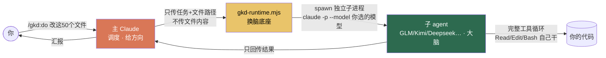
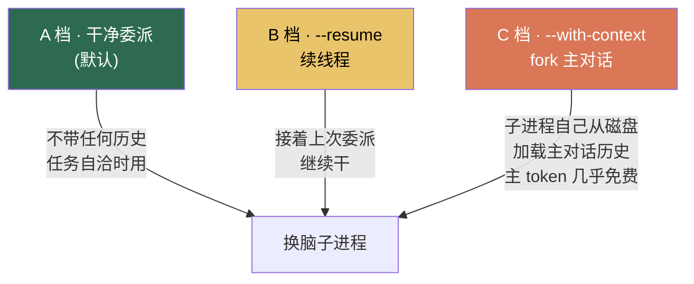
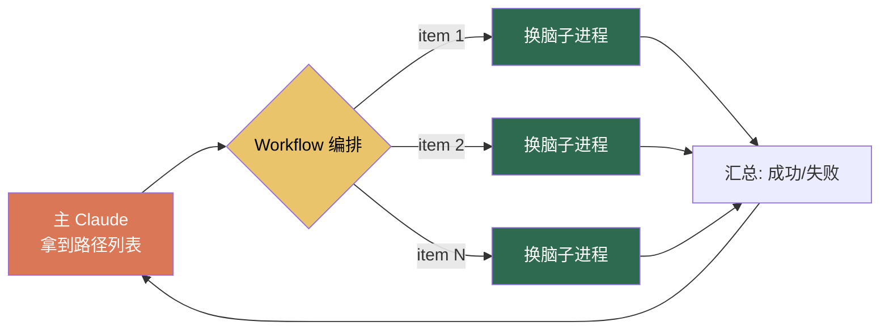

# GKD · 搞快点

<p align="right"><a href="./README.md">中文</a> · <a href="./README.en.md">English</a></p>

> **GKD** 是「**搞快点**」的拼音首字母,也是三个当下前沿开源模型的首字母 —— **G**LM · **K**imi · **D**eepseek。

GKD 是一个 [Claude Code](https://claude.com/claude-code) plugin。它借 Claude Code 自己的工具循环(harness),起一个**以你指定的任意模型为大脑**的子进程去干活——子进程有完整的 Read/Edit/Bash... 工具,在自己的上下文里读文件、思考、改代码、跑命令,只把**结果**回传给主对话。

两个并重的目的:

- **省 token** —— 重活的开销发生在子进程,主 Claude 只付「指令 + 结果」那一点点;可降级的活交给便宜模型即可。
- **借不同模型的视角** —— 代码、长文摘要、视觉、高难推理各有所长;换一个大脑,既能在 brainstorm / cross-review 时跳出单一模型的思维定式,也能把活交给最擅长它的那个模型。

---

## 它解决什么问题

用 Claude Code 时会有两个问题:一是很多活其实**不需要**最贵的旗舰模型(写样板、批量同构改写、格式/语言转换、读长文档做摘要、代码审查……),但默认全喂给同一个主模型,token 哗哗地烧;二是你被**锁死在单一模型的视角**里,想听听 GLM、Kimi、Deepseek、GPT 对同一个问题怎么看,得手动切来切去。

GKD 的思路是**分包给另一个大脑**:主 Claude 给方向,真正读写跑的实活交给一个换了脑的子进程。



关键纪律:**主 Claude 绝不先读文件内容再转发给子进程**,只传文件路径,子进程自己读。这样主对话的 token 占用几乎只剩「下达指令」那一句话。

---

## 省了多少?(`/gkd:stats`)

GKD 自带用量统计,每次委派都记一笔,随时可查省了多少,例如:

```
GKD delegation stats                                      30d · cache 5m old
────────────────────────────────────────────────────────────────────────────

  44 calls · 9 failed · saved $15.40 (↓38%)

  Tokens
    input 6.46M (96%)  ·  output 267.1k (4%)
    cache_r 2.44M  ·  cache_w 0

  Models
    model     │          calls │ tokens │ cache_r/w │    cost
    glm-5.2   │ 21 ok · 2 fail │  2.98M │   1.84M/— │   $5.12
    kimi-k2.6 │  6 ok · 6 fail │ 236.3k │  603.9k/— │ $0.4531
    gpt-5.5   │  8 ok · 1 fail │  3.51M │         — │  $19.22

  Cost
    $24.80 actual  █████████████████░░░░░░░░░░░  $40.20 if Opus
    saved $15.40 · 38% lower
    · baseline claude-opus-4-8
    · public-rate estimate, gateway billing may differ
```

> 成本按 [LiteLLM](https://github.com/BerriAI/litellm) 的公开价格表估算,`baseline` 是「同样的活全用 Opus 跑」的假想成本。实际网关计费可能不同,数字仅供参考方向。

---

## 安装

### 前置条件

- 已安装 [Claude Code](https://claude.com/claude-code)(`claude` 在 PATH 里)
- 至少一个 **Anthropic 兼容**的模型端点(官方 Claude API、OpenRouter、各家兼容网关均可)及其 API Key

### 第一步:添加 marketplace 并安装

```
/plugin marketplace add alvis-HaoH/gkd
/plugin install gkd@gkd
```

然后 `/reload-plugins`(或重启 Claude Code)使命令生效。

> 也可以本地开发模式加载:`claude --plugin-dir /path/to/gkd`

### 第二步:配置你的模型(必做)

GKD 出于安全**不把任何真实端点/密钥入库**。安装后需要你提供一份模型注册表:

```bash
# 进入 plugin 目录(marketplace 安装后在 ~/.claude/plugins/cache/gkd/gkd/<version>/)
cp config/models.example.json config/models.json
# 编辑 models.json,填你自己的端点和模型
```

模板里自带 **GLM · Kimi · Deepseek** 三个示例条目(正是 GKD 名字的由来),你按自己接入的真实端点改写即可。单个模型的结构(完整字段见 `models.example.json` 里的 `_comment`):

```json
{
  "models": {
    "glm": {
      "model": "glm-5.2",
      "baseUrl": "${ANTHROPIC_BASE_URL}",
      "authToken": "${ANTHROPIC_AUTH_TOKEN}",
      "description": "便宜的全能选手,承接绝大多数可降级的活。主 Claude 选模型只看这段描述。",
      "capabilities": ["coding", "agentic"],
      "avoid_for": ["视觉输入"],
      "pricingKey": "fireworks_ai/glm-5p2"
    }
  }
}
```

要点:

- **`baseUrl` / `authToken` 支持 `${ENV_VAR}` 插值** —— 推荐用环境变量传密钥,别把明文写进文件。
- **`description` 是主 Claude 选模型的唯一依据** —— 老实写清这个模型擅长/不擅长什么。
- **第一个未禁用的模型 = 默认模型**。
- 加新模型只改这个文件,runtime 自动读,无需改代码。
- 某些网关未适配新版 CLI 的 `adaptive` thinking 会报 400,可在该模型加 `"env": { "MAX_THINKING_TOKENS": "0" }` 关掉 thinking 绕过。

`models.json` 已在 `.gitignore` 里(含密钥不入库),`models.example.json` 是给所有人看的模板。

---

## 命令速查

| 命令 | 权限 | 用途 |
|---|---|---|
| `/gkd:ask <任务>` | **只读**(Read/Grep/Glob + `git`) | 问 / 分析 / 咨询,主进程物理上无法改文件 |
| `/gkd:do <任务>` | **读写**(+Edit/Write/Bash) | 改文件 / 落盘 / 执行,命令名本身就是你的「同意改」 |
| `/gkd:resume <补充>` | 自动继承上次 | 续上次本目录的委派线程(读/写模式自动继承) |
| `/gkd:review` | 只读 | 代码审查(常规缺陷 / `--adversarial` 对抗式设计审) |
| `/gkd:brainstorm` | 只读 | 多模型**并行独立**发散,主 Claude 综合分歧与共识 |
| `/gkd:workflow` | 视任务 | N 个 item 批量委派,各起一个子进程并行处理 |
| `/gkd:stats` | — | 委派用量与省钱估算|

主 Claude 会**智能补全 flag**:你只需要用自然语言表达,它自己判断选哪个模型、要不要带上对话历史。当然你也可以显式指定:

```
/gkd:do --glm 把 src/legacy/ 下所有 .js 转成 TypeScript
/gkd:ask --gpt 这个并发设计有没有竞态问题?
/gkd:brainstorm 让 glm,kimi,deepseek 一起脑暴下xxx
```

---

## 三个核心机制

### 1. 换脑:唯一可靠的开关

GKD 不靠环境变量换模型(那些常被全局 settings 钉死),而是直接 spawn 一个独立子进程:

```
claude -p --model <你的模型> --setting-sources project ...
```

`--model` 是实测唯一可靠的换脑手段,且子进程 token 与主对话**完全隔离**。

### 2. 上下文三档:按需决定子进程「知道多少」



- **A 档**(默认):任务文本已经写清一切,子进程从零开始,最省。
- **B 档**(`--resume`):接着上次本目录的委派线程往下做,读/写模式自动继承。
- **C 档**(`--with-context`):任务里有「上面那个方案」这种回指时,让子进程**自己**从磁盘 fork 主对话历史——主 Claude 不用把历史复述一遍,所以主 token 几乎免费。

### 3. workflow:批量委派的双层编排

`/gkd:workflow` 把「50 个文件各转一次」这类同构批量,编排成并行的换脑子进程:



每个 item 一个独立子进程,token 互相隔离,还能按 item 或按「worker 干活 / verifier 把关」分配不同模型。

---

## 直接调底座

所有命令最终都调同一个底座,你也可以手动调:

```bash
node "${CLAUDE_PLUGIN_ROOT}/scripts/gkd-runtime.mjs" [--<modelKey>] [选项] "<任务(含文件路径)>"

# 看帮助和当前可用模型
node "${CLAUDE_PLUGIN_ROOT}/scripts/gkd-runtime.mjs" --help
```

关键开关:`--write`(允许改文件)、`--resume`(续线程)、`--with-context`(fork 主对话)、`--prompt-file <path>`(注入前置系统指令,如审查模板)、`--json`(结构化输出,供 workflow 消费)。

---

## 目录结构

```
gkd/
├── .claude-plugin/
│   ├── plugin.json          # plugin 元信息
│   └── marketplace.json     # 自带 marketplace(让别人能一键装)
├── commands/                # 7 个 slash 命令
├── skills/gkd-delegate/     # 委派纪律(主 Claude 自发委派时的纲领)
├── scripts/
│   ├── gkd-runtime.mjs      # 换脑底座(核心)
│   ├── gkd-brainstorm.mjs   # 多模型并行
│   └── gkd-stats.mjs        # 用量统计 TUI
├── bin/gkd-stats            # 零模型成本看 stats 的入口
├── config/
│   ├── models.example.json  # 模型注册表模板(复制成 models.json 用)
│   └── model-routing.md     # 跨模型选择偏好(自然语言,可自由编辑)
└── prompts/                 # review 的两种立场模板
```

命令与模型**完全解耦**:加模型只改 `models.json`,命令文件不动。

---

## License

[MIT](./LICENSE) © alvis-HaoH
